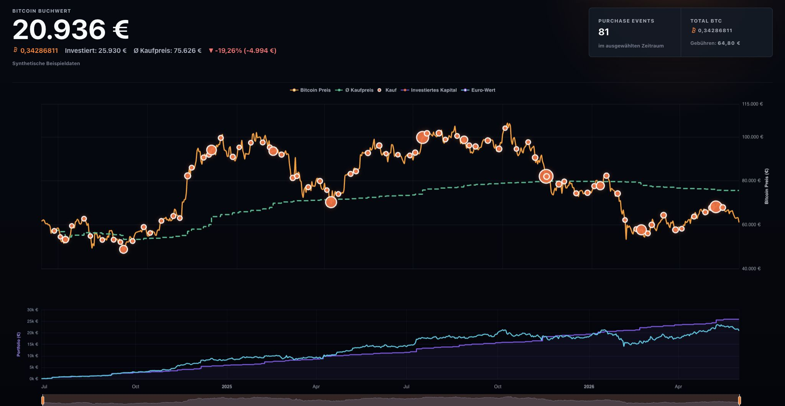

# BodeTracker

BodeTracker is a local browser app for visualizing Bitcoin purchases on a BTC/EUR chart. It imports a local CSV transaction history in the browser, plots purchase events as orange circles, and shows portfolio metrics for the selected time range.



No CSV data is persisted, uploaded, or committed to this repository.

## Requirements

- Node.js 20 or newer
- npm
- Internet access for BTC/EUR market data

## Getting Started

Install dependencies:

```bash
npm install
```

Start the local development server:

```bash
npm run dev
```

Open the app:

```text
http://127.0.0.1:5173/
```

On startup, the app loads a synthetic example CSV so the chart is immediately populated. Use the `CSV laden` button to replace the example data with a local transaction CSV. The app currently expects a CSV with columns similar to:

```text
Timezone,Date,Time,Type,Currency,Amount,Quote Currency,Quote Price,Received / Paid Currency,Received / Paid Amount,Fee currency,Fee amount,Status,Transaction ID,Address
```

Only completed BTC buy transactions are visualized.

The automatically loaded example file with synthetic data is available at:

```text
examples/sample-transactions.csv
```

You can use it to test the app or as a template for converting your own transaction history into the supported format.

## Build

Create a production build:

```bash
npm run build
```

Preview the production build locally:

```bash
npm run preview
```

## Notes

- CSV files are ignored by Git via `.gitignore`.
- The app first tries CoinGecko for market data and falls back to Kraken if needed.
- Sensitive values can be visually censored with the privacy toggle.

## To Do

Open work is tracked in [Todo.md](Todo.md).
